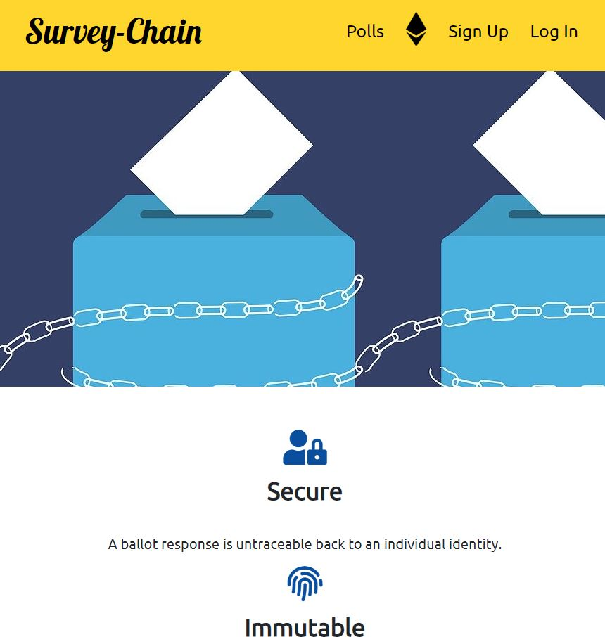
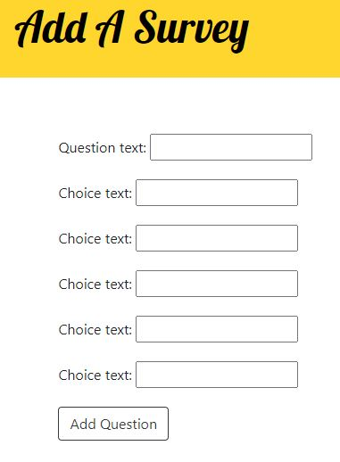
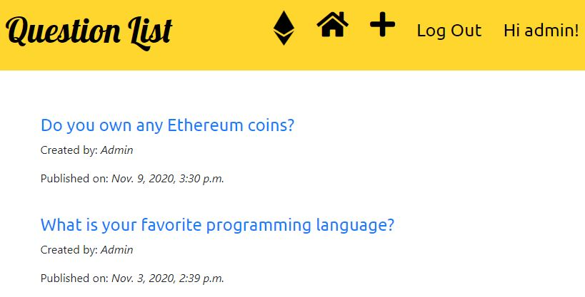
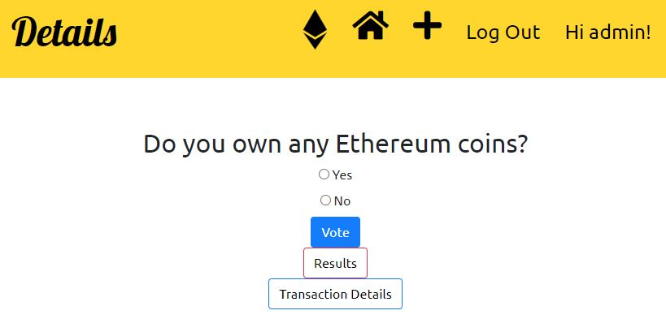
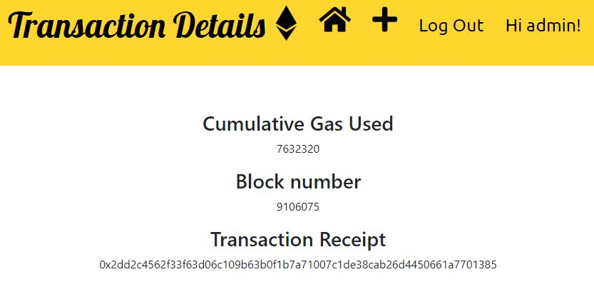
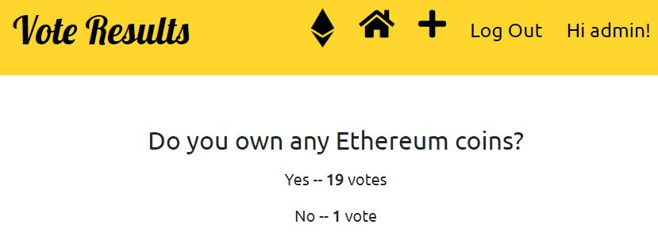

# Survey-Chain Web App
A Django web application that employs Ethereum blockchain technology.

**Add custom survey questions**

**View all surveys**

**Observe survey question details**

**Obtain blockchain information related to your vote**

**Get all vote results for each question**

